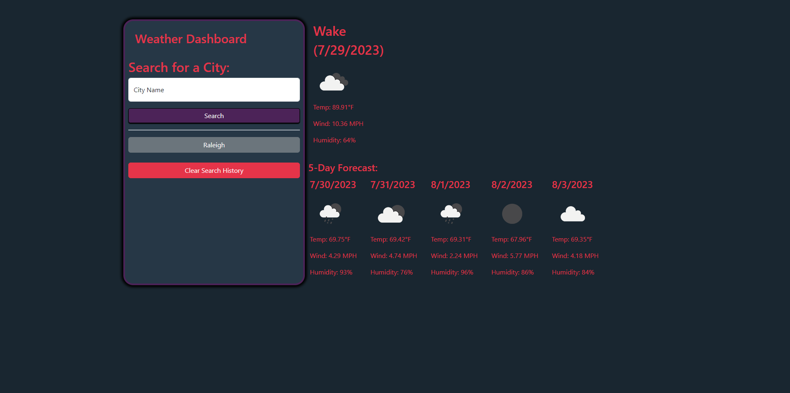

# Weather Dashboard

## Description
This project was provided as a challenge to learn about Server-Side, or Third-Party, APIs and is used for individuals wanting to know the weather conditions that are affecting the area so they can prepare the necessary essentials. This project was made from scratch.

## Deployed Application
https://ljjordan124.github.io/Weather-Dashboard/index.html

## Screenshot
The following image shows the web application's appearance and functionality:

## Features
This website features a search bar used to input city names, and when hitting the "Search" button you are given the current weather and the following 5 days. All searched locations are saved under local storage and can be cleared with the "Clear Search History" button.

## Future Plans
To improve this project in the future, I wish to add an animated background of the current weather of the searched location. However, I quite like it as it is, so this might not happen.

## Languages & Dependencies
English

## Built With
* HTML
* CSS
* Javascript
* Third-party APIs

## License
[MIT](https://choosealicense.com/licenses/mit/)

## Questions - Contact Me
* Email - jordan3313.lj@gmail.com
* LinkedIn - [Laura Delaney](https://www.linkedin.com/in/laura-jordan-510412241/)
